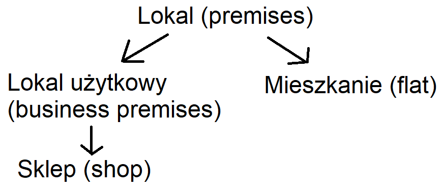

# qt-estatemanager
Project finished in June 2019.

## General info
Basic real estate manager app. It allows to add various types of real estate and edit their parameters. 
Data is not saved in any file. Purpose of app is only to show concept of inheritance and learn basics of object programming.
Project was made as a part of Object Programming Course at my university.
	
## Technologies
Project is created with:
* C++
* QT
* Visual Studio Community

## Inheritance of classes
Classes inheritance diagram is shown below.

